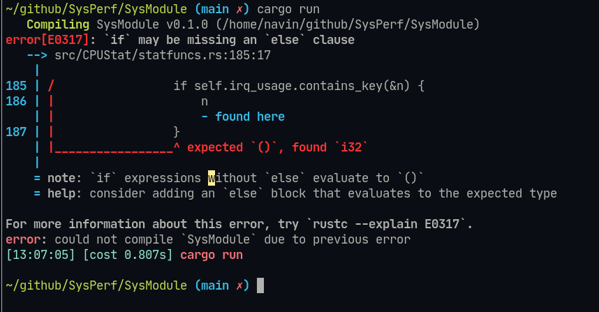
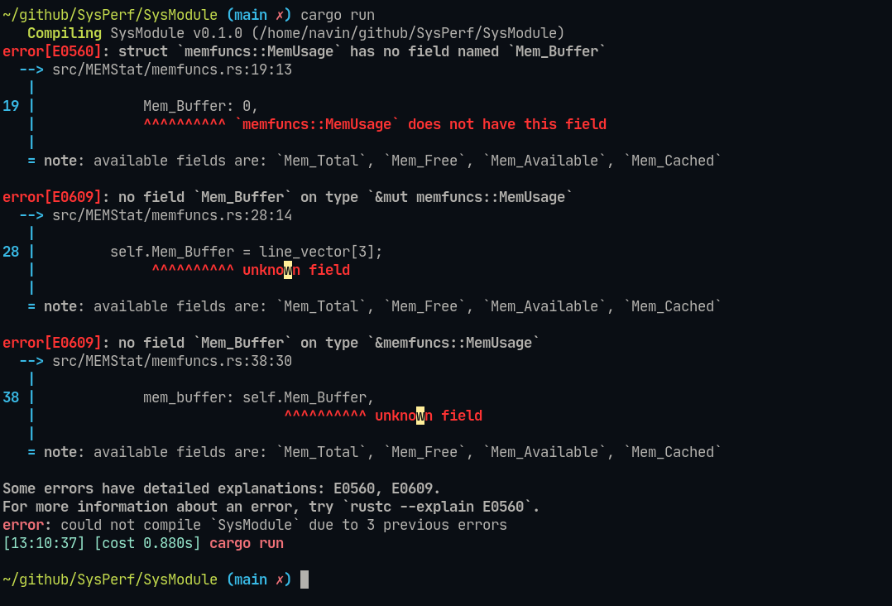
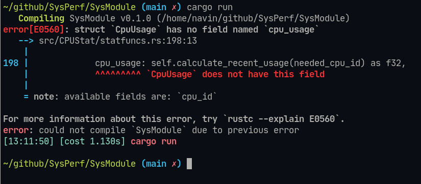
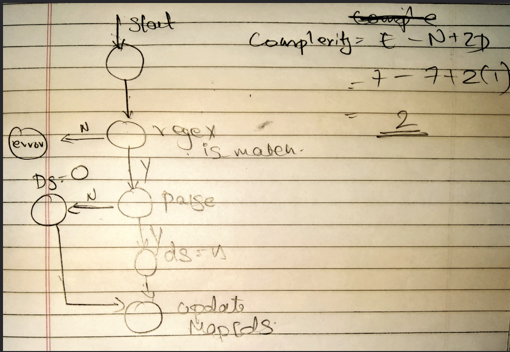

# U3 Software Engineering lab 

## Team Details : 
- Name : P K Navin Shrinivas [PES2UG20CS237]
- Name : Mohamed Ayaan [PES2UG20CS200]
- Name : Mukund Deepak [PES2UG20CS206]
- Name : Nandan H [PES2UG20CS214]

## Question 1 : Unit testing 

- After a systematic approach at demarcating units by help of dependencies and discussion with team mates, we have selected the following units : 
> Note : this code snippet is selected for its ability to operate without any other code. i.e it is self sufficient.
```rs
//Struct creation relative to value generated from the command so be careful, otherwise you could lose on some data.
impl MultiCpuUsage{
    pub fn new() -> MultiCpuUsage {
        //Needs error checking for indexing
        MultiCpuUsage {
            old_user_usage: HashMap::new(),
            old_nice_usage: HashMap::new(),
            old_system_usage: HashMap::new(),
            old_idle_usage: HashMap::new(),
            old_iowait_usage: HashMap::new(),
            old_irq_usage: HashMap::new(),
            old_softirq_usage: HashMap::new(),
            old_steal_usage: HashMap::new(),
            old_guest_usage: HashMap::new(),
            old_guest_nice_usage: HashMap::new(),
            user_usage: HashMap::new(),
            nice_usage: HashMap::new(),
            system_usage: HashMap::new(),
            idle_usage: HashMap::new(),
            iowait_usage: HashMap::new(),
            irq_usage: HashMap::new(),
            softirq_usage: HashMap::new(),
            steal_usage: HashMap::new(),
            guest_usage: HashMap::new(),
            guest_nice_usage: HashMap::new(),
        }
    }
    fn update_values(&mut self, line_vector: Vec<&str>) {
        let re = Regex::new(r"cpu(\d{1,})").unwrap();
        let hash_map_key : i32;
        if re.is_match(line_vector[0].trim()){
            let hash_map_key_temp : &str = &re.captures_iter(line_vector[0]).nth(0).unwrap()[1];
            hash_map_key = match hash_map_key_temp.trim().parse::<i32>(){
                Ok(n) => {n+1},
                _ => { panic!("Something is going seriously wrong!!") }
            };
        }else{
            hash_map_key = 0;
        };
        self.old_user_usage.insert(hash_map_key,*self.user_usage.entry(hash_map_key).or_insert(0));
        self.old_nice_usage.insert(hash_map_key,*self.nice_usage.entry(hash_map_key).or_insert(0));
        self.old_system_usage.insert(hash_map_key,*self.system_usage.entry(hash_map_key).or_insert(0));
        self.old_idle_usage.insert(hash_map_key,*self.idle_usage.entry(hash_map_key).or_insert(0));
        self.old_iowait_usage.insert(hash_map_key,*self.iowait_usage.entry(hash_map_key).or_insert(0));
        self.old_irq_usage.insert(hash_map_key,*self.irq_usage.entry(hash_map_key).or_insert(0));
        self.old_softirq_usage.insert(hash_map_key,*self.softirq_usage.entry(hash_map_key).or_insert(0));
        self.old_steal_usage.insert(hash_map_key,*self.steal_usage.entry(hash_map_key).or_insert(0));
        self.old_guest_usage.insert(hash_map_key,*self.guest_usage.entry(hash_map_key).or_insert(0));
        self.old_guest_nice_usage.insert(hash_map_key,*self.guest_nice_usage.entry(hash_map_key).or_insert(0));

        self.user_usage.insert(hash_map_key,line_vector[1].trim().parse().unwrap());
        self.nice_usage.insert(hash_map_key,line_vector[2].trim().parse().unwrap());
        self.system_usage.insert(hash_map_key,line_vector[3].trim().parse().unwrap());
        self.idle_usage.insert(hash_map_key,line_vector[4].trim().parse().unwrap());
        self.iowait_usage.insert(hash_map_key,line_vector[5].trim().parse().unwrap());
        self.irq_usage.insert(hash_map_key,line_vector[6].trim().parse().unwrap());
        self.softirq_usage.insert(hash_map_key,line_vector[7].trim().parse().unwrap());
        self.steal_usage.insert(hash_map_key,line_vector[8].trim().parse().unwrap());
        self.guest_usage.insert(hash_map_key,line_vector[9].trim().parse().unwrap());
        self.guest_nice_usage.insert(hash_map_key,line_vector[10].trim().parse().unwrap());

    }
    //We are essentially implementing line vector generated from the command, onto the CpuUsage structure.

    fn sum_of_all_new_work(&self, hash_map_key : i32) -> u32 {
        self.user_usage.get(&hash_map_key).unwrap()
            + self.nice_usage.get(&hash_map_key).unwrap()
            + self.system_usage.get(&hash_map_key).unwrap()
            + self.iowait_usage.get(&hash_map_key).unwrap()
            + self.irq_usage.get(&hash_map_key).unwrap()
            + self.softirq_usage.get(&hash_map_key).unwrap()
            + self.steal_usage.get(&hash_map_key).unwrap()
            + self.guest_usage.get(&hash_map_key).unwrap()
            + self.guest_nice_usage.get(&hash_map_key).unwrap()
    }
    fn sum_of_all_old_work(&self, hash_map_key : i32) -> u32 {

        //Unwrap are safe only if caller function has a unwrap check on requested key value.

        self.old_user_usage.get(&hash_map_key).unwrap()
            + self.old_nice_usage.get(&hash_map_key).unwrap()
            + self.old_system_usage.get(&hash_map_key).unwrap()
            + self.old_iowait_usage.get(&hash_map_key).unwrap()
            + self.old_irq_usage.get(&hash_map_key).unwrap()
            + self.old_softirq_usage.get(&hash_map_key).unwrap()
            + self.old_steal_usage.get(&hash_map_key).unwrap()
            + self.old_guest_usage.get(&hash_map_key).unwrap()
            + self.old_guest_nice_usage.get(&hash_map_key).unwrap()
    }

    fn calculate_recent_usage(&self, cpu_id : i32) -> f32 {
        let record1_work = self.sum_of_all_new_work(cpu_id) as f32;
        let record2_work = self.sum_of_all_old_work(cpu_id) as f32;
        let record1_idle = *self.idle_usage.get(&cpu_id).unwrap() as f32;
        let record2_idle = *self.old_idle_usage.get(&cpu_id).unwrap() as f32;

        let cpu_usage = ((record1_work - record2_work)
                         / ((record1_work + record1_idle) - (record2_idle + record2_work)))
            * 100.0;
        println!("{} {} {} {}",cpu_usage, record2_work, record1_work, record1_idle);
        cpu_usage
    }

    //We are using self to obtain the value from the CpuUsage structure as it is being implemented here.
    pub fn convert_to_protobuf(&self, req_payload : CpuUsageRequest) -> CpuUsageProtobuf {
        println!("{:?}", req_payload);
        let needed_cpu_id : i32 = match req_payload.needed_cpu_usage.parse(){
            Ok(n) => { 
                if self.irq_usage.contains_key(&n){
                    n
                }else{
                    print!("{}",n);
                    panic!("Invalid CPU ID") 
                }
            }
            _ => { panic!("Junk CPU ID usage requested") }
        };
        CpuUsageProtobuf{
            cpu_id : String::from(needed_cpu_id.to_string()),
            cpu_usage : self.calculate_recent_usage(needed_cpu_id) as i32,
        }
    }

}
```
- The above code does depend on an external dependency which can not be indicated here, but the external is solely for communication and has to more with coupling and cohesion.:w
> Note :  this unit communicates outside using GRPC's hence, the test cases are based off of on GRPC test commands.

### Tets case 1 : Invalid test case

- **Test case ID**: 1
- **Test priority (Low/Medium/High)**: Medium

- **Designed by Navin Shrinivas**

- **Module Name**: CpuUsage
- **Test Designed Date**: 04/11/22
- **Test Title/Name**: INVALID CPU ID usage request
- **Test Summary/Description**: Aim is to request an invalid CPU ID's usage.
- **Pre-conditions**: The code should be comiling and running properly listening on any one of the ports, the tester should also have grpcurl installed.
- **Dependencies**: cargo toolchains must be installed.
- **Test Steps**: 
  - cargo run [In the root folder]
  - run the below commands using data mentioned in this test [Make sure your path of the new terminal is also in the root directory of the project]
  ```bash
  grpcurl -plaintext -import-path ./src -proto data.proto -d '{ "needed_cpu_usage" : "data_from_dataset" }' localhost:5001 data.protobuf.FetchData/FetchCpuUsage
  ```
- **Test Data**: 
> Note : The data given in the command should be more than the number of threads in the CPU
```
256
512 
```
- **Expected Result**: 
```
From the software : Should be able to detect JUNK CPU ID and not crash.
from grpcurl : Shoudl give an error of no response.
```
- **Post-condition**: The code should still be listening on the same port and should have not crashed

### Tets case 1 : Valid test case

- **Test case ID**: 2
- **Test priority (Low/Medium/High)**: Medium

- **Designed by Navin Shrinivas**

- **Module Name**: CpuUsage
- **Test Designed Date**: 04/11/22
- **Test Title/Name**: VALID CPU ID usage request
- **Test Summary/Description**: Aim is to request an invalid CPU ID's usage.
- **Pre-conditions**: The code should be comiling and running properly listening on any one of the ports, the tester should also have grpcurl installed.
- **Dependencies**: cargo toolchains must be installed.
- **Test Steps**: 
  - cargo run [In the root folder]
  - run the below commands using data mentioned in this test [Make sure your path of the new terminal is also in the root directory of the project]
  ```bash
  grpcurl -plaintext -import-path ./src -proto data.proto -d '{ "needed_cpu_usage" : "data_from_dataset" }' localhost:5001 data.protobuf.FetchData/FetchCpuUsage
  ```
- **Test Data**: 
> Note : the data given in the command needs to be lesser than or equal to the number of cores in the CPU.
```
0
```
- **Expected Result**: 
```
From the software : Should give the CPU usage of asked core ID, or give the entire CPU's USAGE (0).
from grpcurl : Should give back a JSON with cpu_id anf cpu_usage
```
- **Post-condition**: The code should still be listening on the same port and should have not crashed

### Sub question 3 : 

- This module in itself is large enough, on further discussion on reducing unit size, we settled on using uncoupled functions. Functions that are not part of the struct. But this is a anit-pattern given we are using rust and is strongly recommended against.

## Question 2 : Dynamic Testing

### Boundary value analysis (2a)
Testing of data is done based on boundary values or between two opposite ends where the ends may be like from start to end, or lower to upper or from maximum to minimum. Usually occurs after equivalence partioning.
#### Boundary 1 : 
- **Test case ID**: 3
- **Test priority (Low/Medium/High)**: Medium

- **Designed by Navin Shrinivas**

- **Module Name**: CpuUsage
- **Test Designed Date**: 04/11/22
- **Test Title/Name**: LOWER BOUNDARY CPU ID usage request
- **Test Summary/Description**: Aim is to request a cpu's usage with ID on lower end
- **Pre-conditions**: The code should be comiling and running properly listening on any one of the ports, the tester should also have grpcurl installed.
- **Dependencies**: cargo toolchains must be installed.
- **Test Steps**: 
  - cargo run [In the root folder]
  - run the below commands using data mentioned in this test [Make sure your path of the new terminal is also in the root directory of the project]
  ```bash
  grpcurl -plaintext -import-path ./src -proto data.proto -d '{ "needed_cpu_usage" : "0" }' localhost:5001 data.protobuf.FetchData/FetchCpuUsage
  ```
- **Expected Result**: 
```
From the software : give the entire CPU's USAGE (0).
from grpcurl : Should give back a JSON with cpu_id anf cpu_usage
```
- **Post-condition**: The code should still be listening on the same port and should have not crashed


#### Boundary 2 : 
- **Test case ID**: 4
- **Test priority (Low/Medium/High)**: Medium

- **Designed by Navin Shrinivas**

- **Module Name**: CpuUsage
- **Test Designed Date**: 04/11/22
- **Test Title/Name**: UPPER BOUNDARY CPU ID usage request
- **Test Summary/Description**: Aim is to request a cpu's usage with ID on upper end
- **Pre-conditions**: The code should be comiling and running properly listening on any one of the ports, the tester should also have grpcurl installed.
- **Dependencies**: cargo toolchains must be installed.
- **Test Steps**: 
  - cargo run [In the root folder]
  - run the below commands using data mentioned in this test [Make sure your path of the new terminal is also in the root directory of the project]
  ```bash
  grpcurl -plaintext -import-path ./src -proto data.proto -d '{ "needed_cpu_usage" : "upper_limit" }' localhost:5001 data.protobuf.FetchData/FetchCpuUsage
  ```
- **Expected Result**: 
```
From the software : give back the correct usage of last cpu core.
from grpcurl : Should give back a JSON with cpu_id anf cpu_usage
```
- **Post-condition**: The code should still be listening on the same port and should have not crashed


### Mutation testing (2b)
Since our codebases comprises of two components, CpuUsage and MemUsage so we can apply mutiple mutations on these.
1. Remove a the condition to tell that a particular cpu_id doesnt exist.

2. Alter the structure of the memory usage which causes an error to occur as the program cant extract or place the values of the system.

3. Alter the structure of the .proto file and function, so that we cannot read the new values of the system and we will be stuck on the first value.


> Note : the code denies to compile!

The above cases being caught at compile time is what set's Rust, our programming langauge of choice apart of Software Engineering and safe practices!

## Question 3 : Cyclomatic complexity 

- Here are the two cfg's with complexities seperately 


- The over all cyclomatic complexity of 2 graphs together is 4
- As the cyclomatic complexity for an async code is onl 4, we as a team don't seem much room for refactoring
